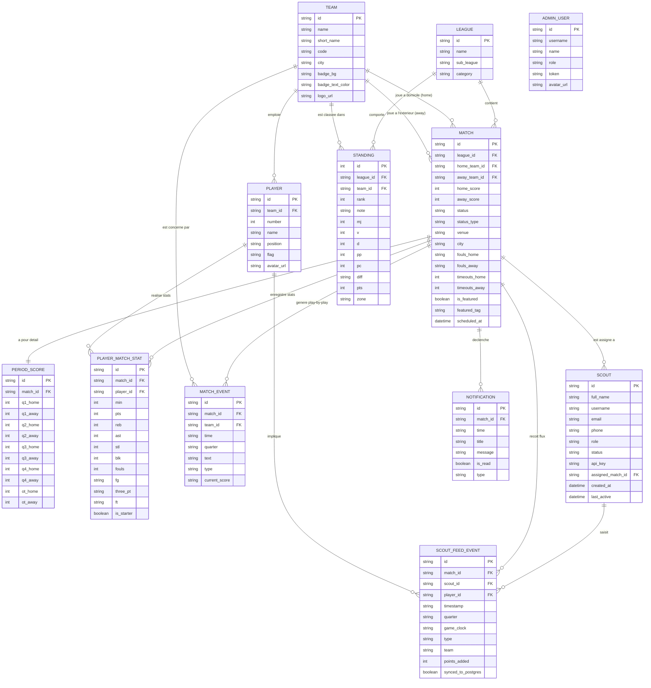

# Modèle Conceptuel de Données (MCD) - IvoireScore / voirScore FIBB

Ce document présente le **Modèle Conceptuel de Données (MCD)** complet de l'application **IvoireScore / voirScore FIBB** (Fédération Ivoirienne de Basketball). Il couvre l'ensemble des fonctionnalités et composants du projet :
- **Plateforme Publique / LiveScore** : Consultation des rencontres en temps réel, scores par période, statistiques détaillées par joueur (Box Score), fil d'actualités action par action (Play-by-play), classements des championnats (N1_H, N2_H, etc.), meilleurs marqueurs, calendrier et recherche.
- **Espace Administration / Dashboard FIBB** : Saisie et modification des matchs, programmation, validation officielle des scores, gestion des équipes/clubs, gestion des effectifs de joueurs et gestion des classements.
- **Espace Scout / Collecte sur le terrain** : Gestion des comptes scouts (opérateurs de saisie live), suivi du statut des scouts, saisie des actions de jeu en temps réel (paniers 2pts, 3pts, lancers francs, fautes, rebonds, pertes de balle, temps-morts), tampon de flux (buffer) et synchronisation vers la base de données PostgreSQL.
- **Préférences & Notifications Utilisateurs** : Gestion des équipes et championnats favoris, paramètres de notification et alertes sonores.

---

## 1. Dictionnaire des Données & Recensement des Entités

### 1.1 `COMPETITION` / `LEAGUE` (Championnat / Ligue)
Représente une compétition ou division gérée par la FIBB (ex: N1_H, N2_H, Coupe Nationale).
- `id_league` (Clé Primaire) : Identifiant unique de la ligue (ex: `n1`, `n2`)
- `nom_league` : Nom complet de la ligue (ex: "CÔTE D'IVOIRE: N1_H FIBB")
- `sub_league` : Sous-titre ou poule (ex: "Journée 14", "Poule A - J10")
- `categorie` : Catégorie d'âge ou de genre (ex: Hommes, Dames, U18)

### 1.2 `EQUIPE` / `TEAM` (Club / Équipe)
Représente un club affilié à la FIBB.
- `id_team` (Clé Primaire) : Identifiant unique du club (ex: `abc`, `jca`)
- `nom_team` : Nom officiel du club (ex: "ABC Fighters")
- `nom_court` : Nom court (ex: "ABC Fighters")
- `code_team` : Sigle / Code trigramme (ex: "ABC", "JCA")
- `ville` : Ville d'attache du club (ex: "Abidjan", "Yamoussoukro", "San Pedro")
- `badge_bg` : Classe ou dégradé de couleur pour l'identité visuelle
- `badge_text_color` : Couleur de texte associée au badge
- `badge_border_color` : Couleur de bordure du badge
- `logo_url` : URL du logo vectoriel ou de l'image du club

### 1.3 `JOUEUR` / `PLAYER` (Joueur)
Représente un athlète licencié évoluant dans une équipe.
- `id_player` (Clé Primaire) : Identifiant unique du joueur (ex: `p1`, `p2`)
- `numero` : Numéro de maillot (ex: 13, 55, 0)
- `nom_joueur` : Nom complet ou usuel (ex: "S. Dieng", "J. Cissé")
- `position` : Poste sur le terrain (Meneur, Arrière, Ailier, Ailier fort, Pivot)
- `drapeau_nationalite` : Émoji ou code du drapeau de nationalité (ex: 🇨🇮, 🇫🇷, 🇺🇸)
- `avatar_url` : Photo ou avatar du joueur
- `id_team` (Clé Étrangère) : Équipe à laquelle appartient le joueur

### 1.4 `RENCONTRE` / `MATCH` (Match)
Représente une rencontre sportive planifiée ou jouée entre deux équipes.
- `id_match` (Clé Primaire) : Identifiant unique du match (ex: `m1`, `m2`)
- `id_league` (Clé Étrangère) : Ligue concernée
- `id_team_home` (Clé Étrangère) : Équipe recevant à domicile
- `id_team_away` (Clé Étrangère) : Équipe visiteuse à l'extérieur
- `score_home` : Score cumulé équipe domicile
- `score_away` : Score cumulé équipe extérieure
- `statut` : Libellé du statut (ex: "Q4 02:45", "Terminé", "21:30 Ce soir")
- `type_statut` : État normalisé (`live`, `finished`, `upcoming`)
- `salle_venue` : Nom du complexe / salle (ex: "Dôme Palais des Sports")
- `ville` : Ville de la rencontre (ex: "Abidjan", "Treichville")
- `fautes_home` : Fautes d'équipe domicile (ex: "4/5")
- `fautes_away` : Fautes d'équipe extérieure (ex: "3/5")
- `timeouts_home` : Temps-morts restants domicile (ex: 1)
- `timeouts_away` : Temps-morts restants extérieur (ex: 2)
- `est_a_la_une` : Booléen indiquant si le match est mis en avant (Hero match)
- `tag_a_la_une` : Libellé ou accroche (ex: "CHOC DE LA JOURNÉE • DÔME PALAIS DES SPORTS")
- `date_heure_programme` : Date et heure prévues

### 1.5 `SCORE_PERIODE` / `PERIOD_SCORE` (Scores par Quart-Temps)
Stocke les détails des scores quart-temps par quart-temps et prolongation pour un match.
- `id_period_score` (Clé Primaire) : Identifiant unique
- `id_match` (Clé Étrangère) : Match associé
- `q1_home`, `q1_away` : Score du 1er quart-temps (ex: 26, 22)
- `q2_home`, `q2_away` : Score du 2ème quart-temps (ex: 24, 28)
- `q3_home`, `q3_away` : Score du 3ème quart-temps (ex: 28, 25)
- `q4_home`, `q4_away` : Score du 4ème quart-temps (ex: 20, 19)
- `ot_home`, `ot_away` : Score de la prolongation si applicable

### 1.6 `STAT_JOUEUR_MATCH` / `PLAYER_MATCH_STAT` (BoxScore du Joueur)
Statistiques individuelles d'un joueur pour un match précis.
- `id_stat` (Clé Primaire) : Identifiant unique de la statistique
- `id_match` (Clé Étrangère) : Match concerné
- `id_player` (Clé Étrangère) : Joueur concerné
- `minutes_jouees` : Minutes de jeu (ex: 30)
- `points` : Points marqués (PTS)
- `rebonds` : Rebonds totaux (REB)
- `passes_decisives` : Passes décisives (AST)
- `interceptions` : Interceptions (STL)
- `penchement_fautes` / `fautes` : Fautes personnelles commises
- `briques_contres` / `contres` : Contres réalisés (BLK)
- `tirs_reussis_tentés` : Format texte tirs au panier (FG, ex: "12/19")
- `tirs_3pts_reussis_tentés` : Format texte tirs à 3 points (3PT, ex: "4/8")
- `lancers_francs_reussis_tentés` : Format texte lancers francs (FT, ex: "4/4")
- `est_titulaire` : Booléen indiquant si le joueur a débuté dans le 5 majeur

### 1.7 `EVENEMENT_MATCH` / `MATCH_EVENT` (Play-By-Play / Fil de Match)
Fil d'actions en direct affiché sur la fiche de match.
- `id_event` (Clé Primaire) : Identifiant de l'événement
- `id_match` (Clé Étrangère) : Match concerné
- `temps_chronometre` : Chronomètre de jeu (ex: "02:45")
- `quart_temps` : Quart-temps concerné (ex: "Q4", "Q3")
- `id_team` (Clé Étrangère) : Équipe à l'origine de l'action
- `description_texte` : Description lisible de l'action
- `type_evenement` : Catégorie d'événement (`score`, `foul`, `timeout`, `sub`)
- `score_actuel` : Score affiché à cet instant (ex: "98 - 94")

### 1.8 `CLASSEMENT` / `STANDING` (Ligne du Classement Officiel)
Données de classement d'un club dans une compétition.
- `id_standing` (Clé Primaire) : Identifiant unique
- `id_league` (Clé Étrangère) : Championnat concerné
- `id_team` (Clé Étrangère) : Équipe concernée
- `rang` : Rang / Position (ex: 1, 2, 12)
- `note_appreciation` : Badge de performance (ex: "LEADER - DÉFENSE #1", "PLAYOFFS SÉCURISÉS")
- `matchs_joues` (MJ) : Nombre de matchs joués
- `victoires` (V) : Victoires
- `defaites` (D) : Défaites
- `points_marques` (PP) : Points marqués au total
- `points_encaisses` (PC) : Points encaissés au total
- `differentiel` (Diff) : Différence de points (ex: "+240")
- `points_classement` (Pts) : Total de points au classement général
- `forme_5_derniers` : Tableau des 5 derniers résultats (ex: V, V, V, V, D)
- `zone_statut` : Zone de qualification (`playoff`, `mid`, `relegation`)

### 1.9 `ADMINISTRATEUR` / `ADMIN_USER` (Compte Administrateur / Commissionnaire)
Gestionnaire de la plateforme FIBB.
- `id_admin` (Clé Primaire) : Identifiant unique
- `nom_utilisateur` : Username de connexion
- `nom_complet` : Prénom et Nom
- `role` : Rôle (`SUPER_ADMIN`, `COMMISSIONER`, `EDITOR`)
- `jeton_session` : Jeton d'authentification (JWT)
- `avatar_url` : Photo de profil

### 1.10 `SCOUT` / `SCOUT_USER` (Opérateur de Saisie / Scout Officiel)
Opérateur accrédité pour saisir les matchs en direct au bord du terrain.
- `id_scout` (Clé Primaire) : Identifiant unique
- `nom_complet` : Nom du scout (ex: "Mamadou Koné")
- `nom_utilisateur` : Identifiant scout (ex: "scout.abidjan1")
- `email` : Adresse email professionnelle
- `telephone` : Numéro de téléphone
- `role_scout` : Niveaux d'accréditation (`scout_lead`, `scout_operator`, `scout_assistant`)
- `statut` : État du scout (`active`, `inactive`, `on_duty`)
- `cle_api` : Clé API unique pour la transmission de données live
- `id_match_assigne` (Clé Étrangère optionnelle) : Match en cours attribué
- `date_creation` : Horodatage de création
- `derniere_activite` : Horodatage/Libellé de dernière saisie

### 1.11 `FLUX_SCOUT_TAMPON` / `SCOUT_FEED_EVENT` (File d'Attente d'Événements Live)
Tampon de transmission des événements enregistrés par un scout avant validation et enregistrement permanent PostgreSQL.
- `id_feed_event` (Clé Primaire) : Identifiant de l'événement en direct
- `id_match` (Clé Étrangère) : Match concerné
- `id_scout` (Clé Étrangère) : Scout émetteur
- `horodatage_temps_reel` : Heure exacte d'envoi (ex: "19:48:12")
- `quart_temps` : Quart-temps ("Q1", "Q2", "Q3", "Q4", "OT")
- `chronometre_jeu` : Temps restant au chrono (ex: "02:45")
- `type_action` : Nature de l'action (`score_2`, `score_3`, `free_throw`, `foul`, `rebound`, `turnover`, `timeout`)
- `cote_equipe` : Côté (`home` ou `away`)
- `id_joueur` (Clé Étrangère optionnelle) : Joueur impliqué
- `points_ajoutes` : Nombre de points ajoutés au score (1, 2 ou 3)
- `synchronise_postgres` : Indicateur de synchronisation effective en base SQL

### 1.12 `NOTIFICATION` (Alerte Utilisateur)
Messages d'alerte et de faits saillants envoyés aux supporters.
- `id_notification` (Clé Primaire) : Identifiant
- `id_match` (Clé Étrangère) : Match associé
- `horodatage` : Temps du match ou heure
- `titre` : Titre de la notification
- `message` : Contenu du message
- `est_lu` : Statut de lecture
- `type_notification` : Type d'alerte (`score`, `end_quarter`, `alert`)

### 1.13 `PREFERENCE_UTILISATEUR` / `USER_FAVORITE` (Favoris du Supporter)
Stockage local ou distant des préférences de navigation du supporter.
- `id_preference` (Clé Primaire) : Identifiant
- `id_match_favori` (Optionnel) : Référence à un match suivi
- `id_league_epinglee` (Optionnel) : Référence à une compétition épinglée
- `son_active` : Activation du retour sonore

---

## 2. Associations et Cardinalités Merise

1. **RATTACHÉ A (`COMPETITION` -> `RENCONTRE`)**
   - Une compétition comporte zéro ou plusieurs rencontres : `(0,N)`
   - Une rencontre appartient obligatoirement à une et une seule compétition : `(1,1)`

2. **DOMICILE (`EQUIPE` -> `RENCONTRE`)**
   - Une équipe peut jouer plusieurs rencontres à domicile : `(0,N)`
   - Une rencontre a une et une seule équipe à domicile : `(1,1)`

3. **EXTÉRIEUR (`EQUIPE` -> `RENCONTRE`)**
   - Une équipe peut jouer plusieurs rencontres à l'extérieur : `(0,N)`
   - Une rencontre a une et une seule équipe extérieure : `(1,1)`

4. **APPARTIENT A (`EQUIPE` -> `JOUEUR`)**
   - Une équipe possède zéro ou plusieurs joueurs dans son effectif : `(0,N)`
   - Un joueur appartient obligatoirement à une seule équipe : `(1,1)`

5. **DÉTAILLE_PERIODE (`RENCONTRE` -> `SCORE_PERIODE`)**
   - Une rencontre possède un et un seul enregistrement de score par période : `(1,1)`
   - Un score par période concerne une et une seule rencontre : `(1,1)`

6. **GÉNÈRE_STAT (`JOUEUR` + `RENCONTRE` -> `STAT_JOUEUR_MATCH`)**
   - Un joueur participe à zéro ou plusieurs rencontres et produit une statistique par match joué : `(0,N)`
   - Une rencontre regroupe les statistiques de plusieurs joueurs : `(0,N)`
   - Une entrée BoxScore concerne exactement un joueur et un match : `(1,1)`

7. **PRODUIT_EVENEMENT (`RENCONTRE` -> `EVENEMENT_MATCH`)**
   - Une rencontre produit zéro ou plusieurs événements play-by-play : `(0,N)`
   - Un événement play-by-play appartient à une et une seule rencontre : `(1,1)`

8. **A_POUR_POSITION (`COMPETITION` + `EQUIPE` -> `CLASSEMENT`)**
   - Une compétition contient le classement de plusieurs équipes : `(1,N)`
   - Une équipe possède une ligne de classement par compétition disputée : `(0,N)`

9. **ASSIGNE_A (`SCOUT` -> `RENCONTRE`)**
   - Un scout peut être assigné à zéro ou une rencontre active : `(0,1)`
   - Une rencontre peut être couverte par zéro ou plusieurs scouts : `(0,N)`

10. **SAISIT_FLUX (`SCOUT` -> `FLUX_SCOUT_TAMPON`)**
    - Un scout émet zéro ou plusieurs événements dans le flux tampon : `(0,N)`
    - Un événement de flux est saisi par un et un seul scout : `(1,1)`

11. **RATTACHÉ_FLUX_MATCH (`RENCONTRE` -> `FLUX_SCOUT_TAMPON`)**
    - Une rencontre reçoit zéro ou plusieurs événements du flux scout : `(0,N)`
    - Un événement du flux scout concerne une et une seule rencontre : `(1,1)`

12. **GENERE_NOTIFICATION (`RENCONTRE` -> `NOTIFICATION`)**
    - Une rencontre génère zéro ou plusieurs notifications : `(0,N)`
    - Une notification concerne une et une seule rencontre : `(1,1)`

---

## 3. Diagramme ERD (Entity-Relationship Diagram - Mermaid)



---

## 4. Modèle Logique de Données (MLD - Relationnel)

- **LEAGUES** (**id_league**, name, sub_league, category)
- **TEAMS** (**id_team**, name, short_name, code, city, badge_bg, badge_text_color, badge_border_color, logo_url)
- **PLAYERS** (**id_player**, #id_team, number, name, position, flag, avatar_url)
- **MATCHES** (**id_match**, #id_league, #home_team_id, #away_team_id, home_score, away_score, status, status_type, venue, city, fouls_home, fouls_away, timeouts_home, timeouts_away, is_featured, featured_tag, scheduled_at, created_at, updated_at)
- **PERIOD_SCORES** (**id_period_score**, #match_id, q1_home, q1_away, q2_home, q2_away, q3_home, q3_away, q4_home, q4_away, ot_home, ot_away)
- **PLAYER_MATCH_STATS** (**id_stat**, #match_id, #player_id, min, pts, reb, ast, stl, blk, fouls, fg, three_pt, ft, is_starter)
- **MATCH_EVENTS** (**id_event**, #match_id, #team_id, time, quarter, text, type, current_score, created_at)
- **STANDINGS** (**id_standing**, #league_id, #team_id, rank, note, mj, v, d, pp, pc, diff, pts, zone, updated_at)
- **ADMIN_USERS** (**id_admin**, username, password_hash, full_name, role, avatar_url, created_at)
- **SCOUTS** (**id_scout**, full_name, username, password_hash, email, phone, role, status, api_key, #assigned_match_id, created_at, last_active)
- **SCOUT_FEED_EVENTS** (**id_feed_event**, #match_id, #scout_id, #player_id, timestamp, quarter, game_clock, type, team_side, points_added, synced_to_postgres, created_at)
- **NOTIFICATIONS** (**id_notification**, #match_id, time, title, message, is_read, type, created_at)

---

## 5. Script SQL DDL d'implémentation PostgreSQL / Cloud SQL

Voici le script SQL complet permettant d'instancier la base de données PostgreSQL pour l'application IvoireScore / voirScore FIBB :

```sql
-- Script DDL officiel PostgreSQL pour IvoireScore / voirScore FIBB
-- Compatible avec PostgreSQL 12+ / Cloud SQL / Supabase

BEGIN;

-- 1. Table des Ligues / Championnats
CREATE TABLE IF NOT EXISTS leagues (
  id VARCHAR(32) PRIMARY KEY,
  name VARCHAR(100) NOT NULL,
  sub_league VARCHAR(50),
  category VARCHAR(30) DEFAULT 'Sénior Hommes',
  created_at TIMESTAMP WITH TIME ZONE DEFAULT CURRENT_TIMESTAMP
);

-- 2. Table des Équipes / Clubs FIBB
CREATE TABLE IF NOT EXISTS teams (
  id VARCHAR(32) PRIMARY KEY,
  name VARCHAR(100) NOT NULL,
  short_name VARCHAR(50) NOT NULL,
  code VARCHAR(10) NOT NULL UNIQUE,
  city VARCHAR(100) NOT NULL,
  badge_bg VARCHAR(100) DEFAULT '',
  badge_text_color VARCHAR(50) DEFAULT '',
  badge_border_color VARCHAR(50) DEFAULT '',
  logo_url TEXT,
  created_at TIMESTAMP WITH TIME ZONE DEFAULT CURRENT_TIMESTAMP
);

-- 3. Table des Joueurs
CREATE TABLE IF NOT EXISTS players (
  id VARCHAR(32) PRIMARY KEY,
  team_id VARCHAR(32) NOT NULL REFERENCES teams(id) ON DELETE CASCADE,
  number INT NOT NULL,
  name VARCHAR(100) NOT NULL,
  position VARCHAR(50) NOT NULL,
  flag VARCHAR(10) DEFAULT '🇨🇮',
  avatar_url TEXT,
  created_at TIMESTAMP WITH TIME ZONE DEFAULT CURRENT_TIMESTAMP
);

-- 4. Table des Rencontres / Matchs
CREATE TABLE IF NOT EXISTS matches (
  id VARCHAR(32) PRIMARY KEY,
  league_id VARCHAR(32) NOT NULL REFERENCES leagues(id),
  home_team_id VARCHAR(32) NOT NULL REFERENCES teams(id),
  away_team_id VARCHAR(32) NOT NULL REFERENCES teams(id),
  home_score INT DEFAULT 0,
  away_score INT DEFAULT 0,
  status VARCHAR(50) NOT NULL DEFAULT 'Upcoming',
  status_type VARCHAR(20) NOT NULL CHECK (status_type IN ('live', 'finished', 'upcoming')),
  venue VARCHAR(150),
  city VARCHAR(100),
  fouls_home VARCHAR(10) DEFAULT '0/5',
  fouls_away VARCHAR(10) DEFAULT '0/5',
  timeouts_home INT DEFAULT 2,
  timeouts_away INT DEFAULT 2,
  is_featured BOOLEAN DEFAULT FALSE,
  featured_tag VARCHAR(150),
  scheduled_at TIMESTAMP WITH TIME ZONE,
  created_at TIMESTAMP WITH TIME ZONE DEFAULT CURRENT_TIMESTAMP,
  updated_at TIMESTAMP WITH TIME ZONE DEFAULT CURRENT_TIMESTAMP
);

-- 5. Table des Scores par Période
CREATE TABLE IF NOT EXISTS period_scores (
  id VARCHAR(64) PRIMARY KEY,
  match_id VARCHAR(32) UNIQUE NOT NULL REFERENCES matches(id) ON DELETE CASCADE,
  q1_home INT DEFAULT 0,
  q1_away INT DEFAULT 0,
  q2_home INT DEFAULT 0,
  q2_away INT DEFAULT 0,
  q3_home INT DEFAULT 0,
  q3_away INT DEFAULT 0,
  q4_home INT DEFAULT 0,
  q4_away INT DEFAULT 0,
  ot_home INT DEFAULT 0,
  ot_away INT DEFAULT 0
);

-- 6. Table des Statistiques Individuelles BoxScore par Match
CREATE TABLE IF NOT EXISTS player_match_stats (
  id VARCHAR(64) PRIMARY KEY,
  match_id VARCHAR(32) NOT NULL REFERENCES matches(id) ON DELETE CASCADE,
  player_id VARCHAR(32) NOT NULL REFERENCES players(id) ON DELETE CASCADE,
  min INT DEFAULT 0,
  pts INT DEFAULT 0,
  reb INT DEFAULT 0,
  ast INT DEFAULT 0,
  stl INT DEFAULT 0,
  blk INT DEFAULT 0,
  fouls INT DEFAULT 0,
  fg VARCHAR(20) DEFAULT '0/0',
  three_pt VARCHAR(20) DEFAULT '0/0',
  ft VARCHAR(20) DEFAULT '0/0',
  is_starter BOOLEAN DEFAULT FALSE,
  CONSTRAINT unique_player_match UNIQUE (match_id, player_id)
);

-- 7. Table du Play-By-Play / Fil d'Événements du Match
CREATE TABLE IF NOT EXISTS match_events (
  id VARCHAR(64) PRIMARY KEY,
  match_id VARCHAR(32) NOT NULL REFERENCES matches(id) ON DELETE CASCADE,
  team_id VARCHAR(32) REFERENCES teams(id),
  time VARCHAR(20) NOT NULL,
  quarter VARCHAR(10) NOT NULL,
  text TEXT NOT NULL,
  type VARCHAR(30) NOT NULL CHECK (type IN ('score', 'foul', 'timeout', 'sub')),
  current_score VARCHAR(20) NOT NULL,
  created_at TIMESTAMP WITH TIME ZONE DEFAULT CURRENT_TIMESTAMP
);

-- 8. Table des Classements Officiels
CREATE TABLE IF NOT EXISTS standings (
  id SERIAL PRIMARY KEY,
  league_id VARCHAR(32) NOT NULL REFERENCES leagues(id),
  team_id VARCHAR(32) NOT NULL REFERENCES teams(id),
  rank INT NOT NULL,
  note VARCHAR(100),
  mj INT DEFAULT 0,
  v INT DEFAULT 0,
  d INT DEFAULT 0,
  pp INT DEFAULT 0,
  pc INT DEFAULT 0,
  diff VARCHAR(20) DEFAULT '0',
  pts INT DEFAULT 0,
  zone VARCHAR(20) DEFAULT 'mid' CHECK (zone IN ('playoff', 'mid', 'relegation')),
  updated_at TIMESTAMP WITH TIME ZONE DEFAULT CURRENT_TIMESTAMP,
  CONSTRAINT unique_league_team UNIQUE (league_id, team_id)
);

-- 9. Table des Administrateurs / Commissionnaires FIBB
CREATE TABLE IF NOT EXISTS admin_users (
  id VARCHAR(32) PRIMARY KEY,
  username VARCHAR(50) NOT NULL UNIQUE,
  password_hash VARCHAR(255) NOT NULL,
  full_name VARCHAR(100) NOT NULL,
  role VARCHAR(30) DEFAULT 'EDITOR' CHECK (role IN ('SUPER_ADMIN', 'COMMISSIONER', 'EDITOR')),
  avatar_url TEXT,
  created_at TIMESTAMP WITH TIME ZONE DEFAULT CURRENT_TIMESTAMP
);

-- 10. Table des Scouts Officiels (Opérateurs de terrain)
CREATE TABLE IF NOT EXISTS scouts (
  id VARCHAR(32) PRIMARY KEY,
  full_name VARCHAR(100) NOT NULL,
  username VARCHAR(50) NOT NULL UNIQUE,
  password_hash VARCHAR(255) NOT NULL,
  email VARCHAR(150) NOT NULL UNIQUE,
  phone VARCHAR(30),
  role VARCHAR(30) DEFAULT 'scout_operator' CHECK (role IN ('scout_lead', 'scout_operator', 'scout_assistant')),
  status VARCHAR(20) DEFAULT 'active' CHECK (status IN ('active', 'inactive', 'on_duty')),
  api_key VARCHAR(100) UNIQUE,
  assigned_match_id VARCHAR(32) REFERENCES matches(id) ON DELETE SET NULL,
  created_at TIMESTAMP WITH TIME ZONE DEFAULT CURRENT_TIMESTAMP,
  last_active TIMESTAMP WITH TIME ZONE
);

-- 11. Table du Tampon de Flux Scout Live
CREATE TABLE IF NOT EXISTS scout_feed_events (
  id VARCHAR(64) PRIMARY KEY,
  match_id VARCHAR(32) NOT NULL REFERENCES matches(id) ON DELETE CASCADE,
  scout_id VARCHAR(32) NOT NULL REFERENCES scouts(id),
  player_id VARCHAR(32) REFERENCES players(id),
  timestamp VARCHAR(20) NOT NULL,
  quarter VARCHAR(10) NOT NULL,
  game_clock VARCHAR(20) NOT NULL,
  type VARCHAR(30) NOT NULL CHECK (type IN ('score_2', 'score_3', 'free_throw', 'foul', 'rebound', 'turnover', 'timeout')),
  team_side VARCHAR(10) NOT NULL CHECK (team_side IN ('home', 'away')),
  points_added INT DEFAULT 0,
  synced_to_postgres BOOLEAN DEFAULT FALSE,
  created_at TIMESTAMP WITH TIME ZONE DEFAULT CURRENT_TIMESTAMP
);

-- 12. Table des Notifications Utilisateurs
CREATE TABLE IF NOT EXISTS notifications (
  id VARCHAR(64) PRIMARY KEY,
  match_id VARCHAR(32) REFERENCES matches(id) ON DELETE CASCADE,
  time VARCHAR(20) NOT NULL,
  title VARCHAR(150) NOT NULL,
  message TEXT NOT NULL,
  is_read BOOLEAN DEFAULT FALSE,
  type VARCHAR(30) DEFAULT 'score' CHECK (type IN ('score', 'end_quarter', 'alert')),
  created_at TIMESTAMP WITH TIME ZONE DEFAULT CURRENT_TIMESTAMP
);

-- Index pour optimiser les requêtes temps réel
CREATE INDEX IF NOT EXISTS idx_matches_status ON matches(status_type);
CREATE INDEX IF NOT EXISTS idx_matches_league ON matches(league_id);
CREATE INDEX IF NOT EXISTS idx_players_team ON players(team_id);
CREATE INDEX IF NOT EXISTS idx_scout_feed_match ON scout_feed_events(match_id);
CREATE INDEX IF NOT EXISTS idx_match_events_match ON match_events(match_id);
CREATE INDEX IF NOT EXISTS idx_standings_league ON standings(league_id);

COMMIT;
```
